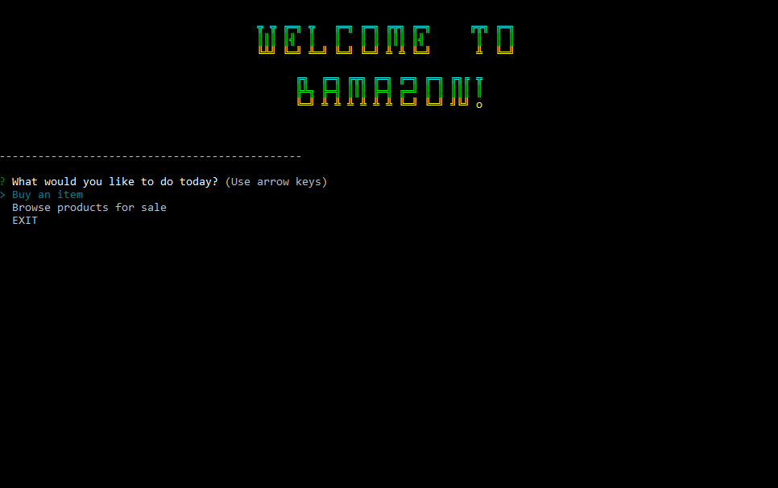
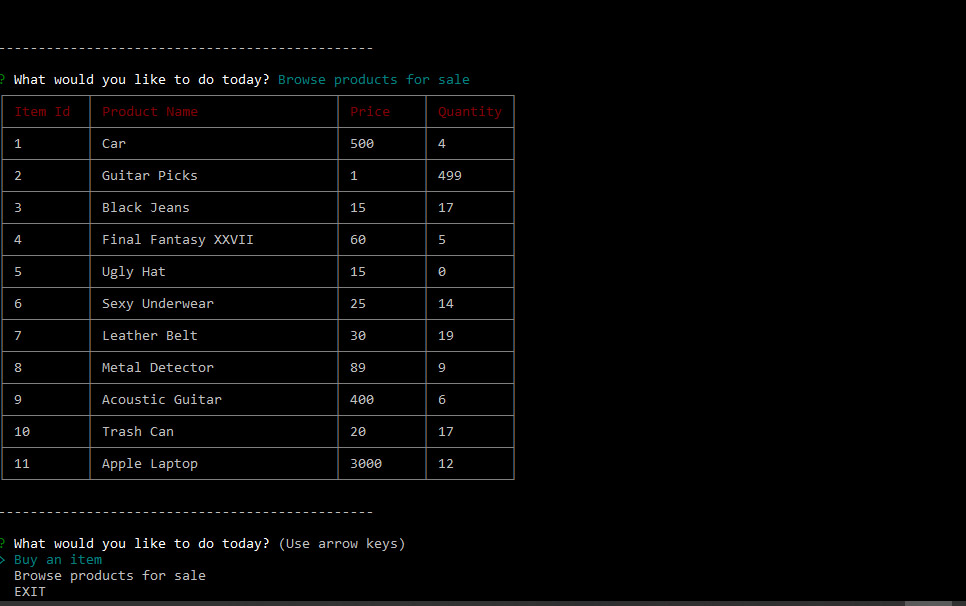
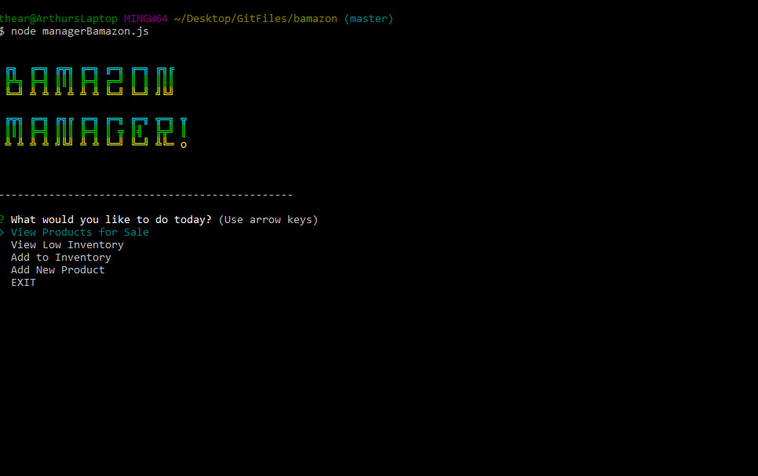
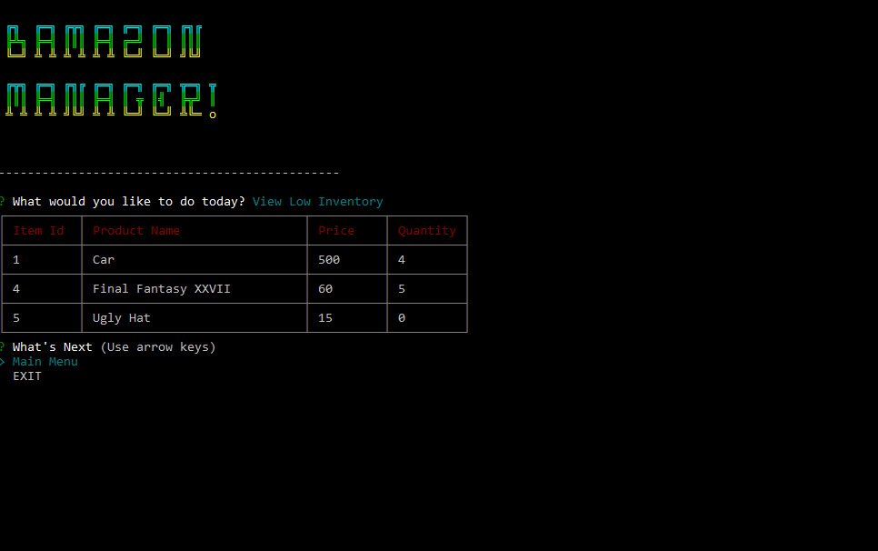
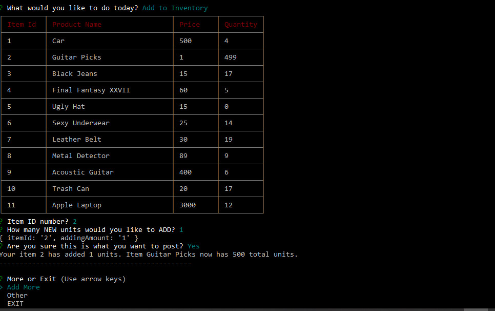

# Bamazon-node-app

### What would Amazon look like in the 80's but written with code from the 21st Century? 
* Customers can buy from a list of items from the Bamazon Database
* Easily keeps track of all inventory with no hassle
* A specialized manager screen for updating and adding new inventory
* Very sleek 80's user interface

# how to use it

Our friendly interface makes this app easy to use and should be self explanitory. A logical and classic prompt style menu takes you step by step through ordering from the vast SQL Database.

There is also a seperate CRUD manager screen for the editing if inventory!

# Screenshots

### Customer Start Screen

### Table Display

### Manager Start Screen

### Manager Inventory

### Manager Adding Inventory

#  

### Here is a [video](https://drive.google.com/file/d/16iYpSflIjS87BcdsXtdFsSUSUOIQ2qcM/view?usp=sharing) of the working version!

### Please check out more fun things on [My Portfolio](https://theartofnoise.github.io/Bootstrap-Portfolio/)!!
